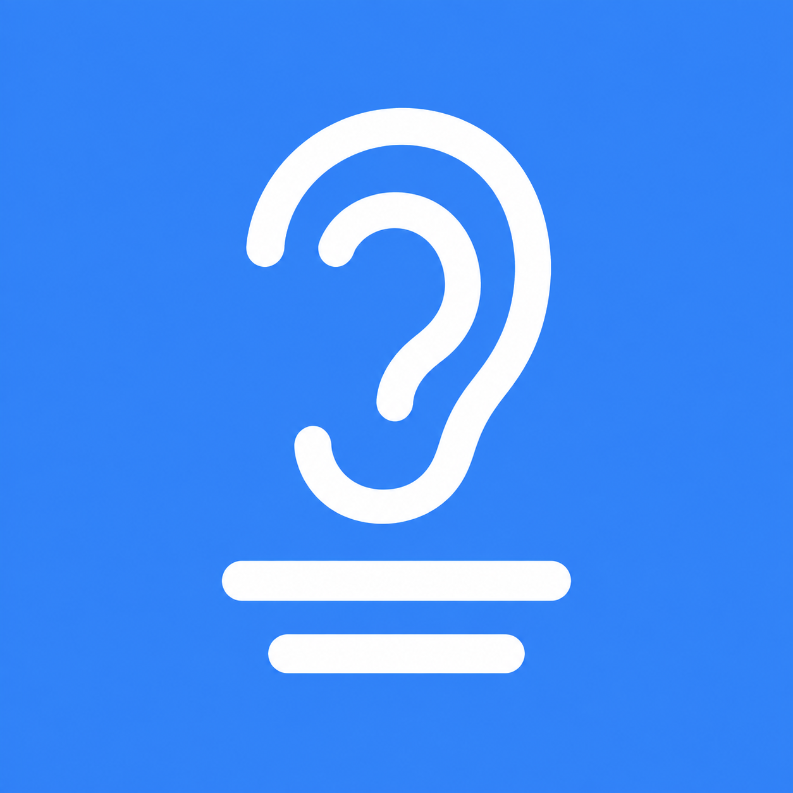

# 听见 Tingjian

<p></p>

**为线上会议提供实时英文识别与中文字幕的 Mac 桌面应用。**

原生 macOS 应用原型，适用于 Apple Silicon Mac、macOS 26.4 或更高版本。

## 使用

1. 按下方说明从源码构建，打开 `dist/听见.app`。
2. 打开 Zoom 或腾讯会议，在听见右侧「会议软件」下拉框选择对应软件。新打开的软件可点击刷新加入列表。
3. 点击「开始翻译」。首次使用可能需要允许 macOS 的音频访问；不需要选择屏幕或共享整个系统。
4. 所选软件播放英文后，显示英文与中文字幕。戴耳机也能使用；不采集麦克风。
5. 更换软件时先暂停，再选择新来源。暂停后保留字幕记录；「本次记录 → 导出」可保存文本。

首次使用若模型尚未安装，点击「准备本地模型」并完成 Apple 语言模型下载。本机已安装模型时无需重复下载，使用 Apple 引擎不需要 API Key。

## 0.3.0 翻译模型选择

在右侧「字幕设置 → 翻译模型」选择 Apple 本地翻译或 oMLX 本地模型。英文语音识别始终由 macOS SpeechAnalyzer 完成。

使用 oMLX：先启动本机 oMLX，填写服务地址（默认 `http://127.0.0.1:18000/v1`），点击「连接 / 刷新模型」，在下拉框中选择已安装的模型，再点击「引擎自检」验证真实识别和翻译。模型列表可见不代表推理一定可用；不支持的模型会显示服务错误。

API Key 留空时从本机 `~/.omlx/settings.json` 读取，不复制或写入工程；也可以手动填写，仅保存在本次运行内存中。仅接受本机 HTTP 地址，不支持远程服务器，不发送屏幕或原始音频给 oMLX。识别出的英文文本会发送给本机 oMLX；服务自身日志策略由 oMLX 控制。

引擎、地址与模型选择自动记忆。采集中不能更改设置；暂停后切换，已有字幕保留，未完成的翻译在继续时使用所选模型处理。切换不会重新翻译已有中文字幕。服务中断时保留英文，恢复后点击「重试翻译」。每次收到完整句子的译文后更新字幕，不显示模型思考过程。翻译准确度取决于所选模型，日期、专有名词仍需核对。

## 0.2.1 连续字幕

主窗口与悬浮字幕同时保留多句双语字幕，默认高度可容纳约 3–5 句短字幕（长句自动换行，可拖大悬浮窗口）。滚轮、触控板或「上一页」可以查看更早内容；翻阅历史后暂停自动跟随，点击「回到最新」恢复实时跟随。右侧「本次记录」也使用相同阅读方式，不会被新字幕强制拉到底部。

开启「鼠标穿透」后悬浮窗不能接收滚动或按钮点击；查看历史前可在主面板关闭穿透，或直接在主窗口翻阅。

## 按应用采集方式

使用 Core Audio process tap，仅包含所选应用及已识别的同一应用辅助进程。列表优先显示 Zoom、腾讯会议，也可选择其他正在运行的软件。没有全局音频采集兜底，不使用 ScreenCaptureKit 或屏幕来源选择器，不读取屏幕帧，不改变系统默认输入/输出设备。

macOS 仍管理音频访问授权，并可能显示系统录音状态指示。音频访问与屏幕共享是不同的能力；本版本不请求录屏。浏览器作为应用来源时可能包含该浏览器多个标签页的声音。会议软件重启或新建辅助音频进程后，如未收到声音，请暂停、刷新列表后重新开始。

## 原型功能与范围

- Apple SpeechAnalyzer 流式英文识别；Apple Translation 或 oMLX 本机模型英译中。
- 原生主窗口、悬浮字幕、菜单栏、字号及透明度、双语显示、置顶和鼠标穿透。
- 原始音频仅在内存中处理，不写入音频文件；字幕退出即清除，仅主动导出时保存。
- 「字幕演示」为预设文本；「引擎自检」为合成语音识别和翻译，均不能替代真实会议测试。
- 不提供麦克风翻译、说话人识别或云端备用服务。实际延迟与识别质量依赖声音和设备状态。
- 开发版采用本机 ad-hoc 签名，未进行 Developer ID 公证。

## 构建与验证

安装 Apple Command Line Tools（`xcode-select --install`）和支持 macOS 26.4 API 的 SDK 后运行。已验证 Swift 6.3.3 / macOS SDK 26.5；不需要完整 Xcode 工程或第三方依赖。

```sh
git clone https://github.com/Mingrui-zj/tingjian.git
cd tingjian
bash build.sh
open dist/听见.app
```

脚本生成 `dist/听见.app`，使用本机临时签名并运行字幕状态检查。构建缓存写入仓库内 `.build/`。这是源码工程；仓库不包含 Apple 语言模型、预编译应用或会议记录。详细实测见 [VALIDATION.md](VALIDATION.md)。

当前为开发原型，尚未提供经过 Developer ID 公证的安装包。建议朋友在自己的 Mac 上构建运行；首次音频访问与语言模型下载由 macOS 提示。

技术资料：[Core Audio 应用音频采集](https://developer.apple.com/documentation/coreaudio/capturing-system-audio-with-core-audio-taps)、[SpeechAnalyzer](https://developer.apple.com/documentation/speech/speechanalyzer)、[TranslationSession](https://developer.apple.com/documentation/translation/translationsession)。


接口错误处理测试：`bash Tools/ModelTests/run.sh`（使用本机 18091 端口的模拟服务，不调用真实模型）。

## 工程结构

- `Sources/AudioCapture.swift`：Core Audio 按应用采集。
- `Sources/AppModel.swift`：识别、翻译与会话状态。
- `Sources/Transcript.swift`：字幕修订、翻译版本检查、导出与状态测试。
- `Sources/Views.swift`：主面板、连续字幕、历史翻页。
- `Sources/TingjianApp.swift`：应用与菜单栏入口。
- `Sources/EngineSelfTest.swift`、`Tools/EngineProbe.swift`：引擎诊断。
- `Assets/`：当前图标，使用 image_gen 生成。

## 反馈

欢迎通过 GitHub Issues 反馈问题。请说明 macOS 版本、芯片型号、会议软件及复现步骤，并移除截图中的会议内容和个人信息。
